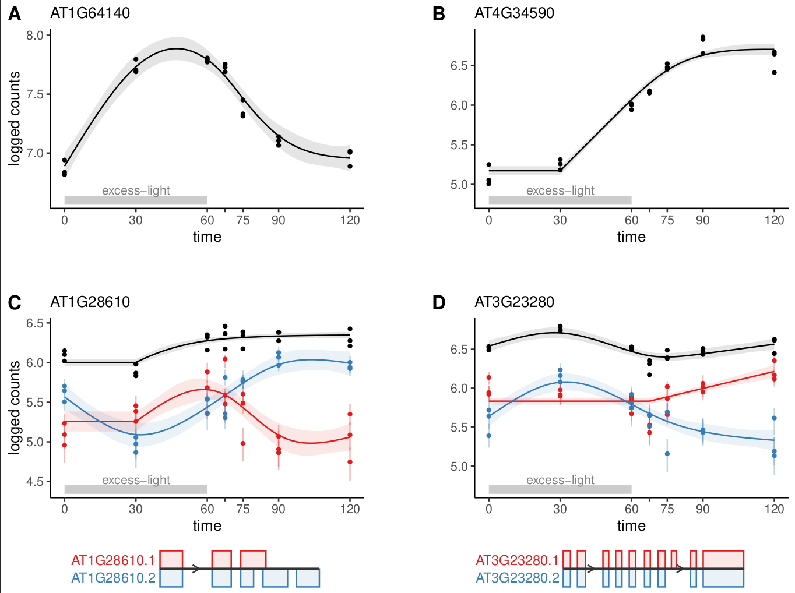

```{r, include = FALSE}
knitr::opts_chunk$set(
  collapse = TRUE,
  comment = "#>",
  fig.path = "man/figures/README-",
  out.width = "100%"
)
```


## <span style="font-weight: normal">**cpam** (**c**hange**p**oint **a**dditive **m**odels)</span>

{width=800 height=600}

**cpam** is an R package for omics time series analysis.


## Key features
 - **Changepoint detection**: Identify sharp transitions in gene expression.
 - **smooth trends**: Model gene expression as a smooth function of time.
 - **Shape-constrained trends**: Cluster genes into biologically meaningful temporal shape classes.
 - **Quantification uncertainty**: Account for uncertainty in expression estimates.
 - **Transcript-level analysis**: Perform gene- or transcript-level inferences. Aggregate $p$-values at the gene level for improved power.
 - **Case-only or case-control time series**: Analyse time series data with or without controls.
 - **User-friendly**: Sensible defaults and an interactive *shiny* interface.

Our new package **cpam** provides a comprehensive framework for analysing time series omics data that combines statistical rigour with practical utility. The method leverages modern statistical approaches while remaining user-friendly, through sensible defaults and an interactive interface. 
Researchers can directly address key questions in time series analysis---when changes occur, what patterns they follow, and how responses are related. While we have focused on transcriptomics, the framework is applicable to other high-dimensional time series measurements, making it a valuable addition to the omics analysis toolkit.

## Installation
```{r, eval = FALSE}
# Installation code here
remotes::install_github("l-a-yates/cpam")
```

## Usage
Load package and create a tibble for the experimental design. Here we are using kallisto-generated counts, so we provide the file path for each sample.
```{r, echo = TRUE}
library(cpam)

exp_design
```

You will also need a tibble with transcript-to-gene mapping,,unless your counts are aggregated at the gene level (transcript-level analysis is recommened). E.g., for *Arabidopsis thaliana*:
```{r}
t2g
```
Now you can run **cpam**
```{r, eval = FALSE}
  cpo <- prepare_cpam(exp_design = exp_design,
                      t2g = t2g,
                      import_type = "kallisto",
                      num_cores = 5) # about 1 min
  cpo <- compute_p_values(cpo) # 30 secs to 5 min
  cpo <- estimate_changepoint(cpo) # 1-10 min
  cpo <- select_shape(cpo) # 1-20 min

```
