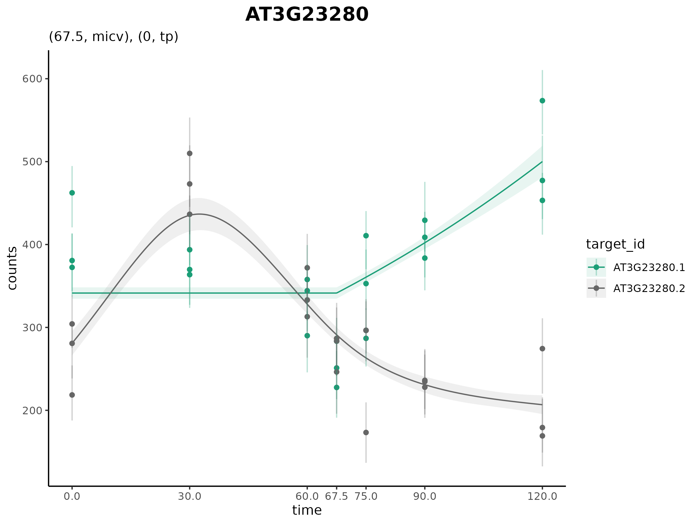

## cpam <span style="font-weight: normal">(**c**hange**p**oint **a**dditive **m**odels)</span>

<!-- badges: start -->

[](https://github.com/l-a-yates/cpam/actions/workflows/R-CMD-check.yaml)
[](https://CRAN.R-project.org/package=cpam)
<!-- badges: end -->

### An R package for omics time series analysis.

Read the methods paper [here](https://doi.org/10.1101/2024.12.22.630003)


Application of **cpam** to RNA-seq time series of *Arabidopsis* plants
treated with excess-light.

## Key features

- **Changepoint detection**: Identify sharp transitions in expression.
- **smooth trends**: Model expression as a smooth function of time.
- **Shape-constrained trends**: Cluster targets into biologically
  meaningful temporal shape classes.
- **Quantification uncertainty**: Account for uncertainty in expression
  estimates.
- **Transcript-level analysis**
  - Perform gene- or transcript-level inferences.
  - Aggregate $p$-values at the gene level for improved power.
- **Case-only or case-control time series**: Analyse time series data
  with or without controls.
- **User-friendly**: Sensible defaults and an interactive *shiny*
  interface.

Our new package **cpam** provides a comprehensive framework for
analysing time series omics data. The method uses modern statistical
approaches while remaining user-friendly, through sensible defaults and
an interactive interface. Researchers can directly address key questions
in time series analysis—when changes occur, what patterns they follow,
and how responses are related. While we have focused on transcriptomics,
the framework is applicable to other high-dimensional time series
measurements.

If you encounter issues or have suggestions for improvements, please
open an [issue](https://github.com/l-a-yates/cpam/issues). We welcome
questions and discussion about using **cpam** for your research through
[Discussions](https://github.com/l-a-yates/cpam/discussions/). Our goal
is to work with users to make **cpam** a robust and valuable tool for
time series omics analysis. We can also be contacted via the email
addresses listed in our paper
[here](https://doi.org/10.1101/2024.12.22.630003).

## Installation

The package is available on CRAN and can be installed using the
following command:

``` r
install.packages("cpam")
```

## Usage

### Step 1: Load the package

``` r
library(cpam)
```

### Step 2: Create a tibble for the experimental design.

In this *Arabidopsis thaliana* time series example, we used the software
[kallisto](https://doi.org/10.1038/nbt.3519) to generate counts from
RNA-seq data. To load the counts, we provide the file path for each
kallisto output file (alternatively you can provide the counts directly
as count matrix, or use other quantification software)

``` r

# load example data
load(system.file("extdata", "exp_design_path.rda", package = "cpam"))
head(exp_design_path)
#>   sample time                                path condition
#> 1 JHSS01    0 output/kallisto/JHSS01/abundance.h5 treatment
#> 2 JHSS02    0 output/kallisto/JHSS02/abundance.h5 treatment
#> 3 JHSS03    0 output/kallisto/JHSS03/abundance.h5 treatment
#> 4 JHSS04    0 output/kallisto/JHSS04/abundance.h5 treatment
#> 5 JHSS05    0 output/kallisto/JHSS05/abundance.h5 treatment
#> 6 JHSS06    5 output/kallisto/JHSS06/abundance.h5 treatment
```

### Step 3: Obtain a table with the transcript-to-gene mapping

N.B. This is not needed if your counts are aggregated at the gene level,
but transcript-level analysis with aggregation of $p$-values to the gene
level is recommended. E.g., for *Arabidopsis thaliana*:

``` r

# load example data
load(system.file("extdata", "t2g_arabidopsis.rda", package = "cpam"))

head(t2g_arabidopsis)
#>     target_id   gene_id
#> 1 AT1G01010.1 AT1G01010
#> 2 AT1G01020.2 AT1G01020
#> 3 AT1G01020.6 AT1G01020
#> 4 AT1G01020.1 AT1G01020
#> 5 AT1G01020.4 AT1G01020
#> 6 AT1G01020.5 AT1G01020
```

### Step 4: Run **cpam**

``` r
  cpo <- prepare_cpam(exp_design = exp_design_path,
                      count_matrix = NULL,
                      t2g = t2g_arabidopsis,
                      model = "case-only",
                      import_type = "kallisto",
                      num_cores = 5)
  cpo <- compute_p_values(cpo) 
  cpo <- estimate_changepoint(cpo) 
  cpo <- select_shape(cpo) 
```

### Step 5: Visualise the results

Load the shiny app for an interactive visualisation of the results:

``` r
  visualise(cpo) # not shown in vignette
```

Or plot one gene at a time:

``` r
  plot_cpam(cpo, gene_id = "AT3G23280")
```



Isoform 1 (AT3G23280.1) has a changepoint at 67.5 min and has a
monotonic increasing concave (micv) shape. Isoform 2 (AT3G23280.2) has
no changepoint and has an unconstrained thin-plate (tp) shape. <br><br>

We can generate a results table which has $p$-values, shapes, log-fold
changes and counts with many optimal filters (see tutorials):

``` r
  results(cpo)
#> # A tibble: 15,279 × 25
#>    target_id   gene_id     p    cp shape lfc.0 lfc.5 lfc.10 lfc.20 lfc.30 lfc.45
#>    <chr>       <chr>   <dbl> <dbl> <chr> <dbl> <dbl>  <dbl>  <dbl>  <dbl>  <dbl>
#>  1 AT1G01910.1 AT1G01…     0     0 micv      0 1.01   1.70   2.38   2.60   2.73 
#>  2 AT1G01910.2 AT1G01…     0    10 cv        0 0      0      0.553  0.775  0.790
#>  3 AT1G01910.5 AT1G01…     0    10 cx        0 0      0     -3.20  -4.57  -4.82 
#>  4 AT1G02610.1 AT1G02…     0    45 mdcx      0 0      0      0      0      0    
#>  5 AT1G02610.2 AT1G02…     0    10 cx        0 0      0     -0.645 -1.16  -1.71 
#>  6 AT1G02610.3 AT1G02…     0    10 mdcx      0 0      0     -1.48  -2.11  -2.25 
#>  7 AT1G04080.1 AT1G04…     0    10 cv        0 0      0      2.75   3.85   3.97 
#>  8 AT1G04080.2 AT1G04…     0    45 micv      0 0      0      0      0      0    
#>  9 AT1G04080.3 AT1G04…     0     0 micv      0 0.268  0.445  0.603  0.638  0.656
#> 10 AT1G04080.5 AT1G04…     0    10 cx        0 0      0     -2.17  -3.04  -3.10 
#> # ℹ 15,269 more rows
#> # ℹ 14 more variables: lfc.60 <dbl>, lfc.90 <dbl>, lfc.180 <dbl>,
#> #   lfc.240 <dbl>, counts.0 <dbl>, counts.5 <dbl>, counts.10 <dbl>,
#> #   counts.20 <dbl>, counts.30 <dbl>, counts.45 <dbl>, counts.60 <dbl>,
#> #   counts.90 <dbl>, counts.180 <dbl>, counts.240 <dbl>
```

### Tutorials

For a quick-to-run introductory example, we have provided a small
simulated data set as part of the package.

- [Introductory
  Example](https://raw.githack.com/l-a-yates/cpam_manuscript/main/R/example.html)

The following two tutorials use real-world data to demonstrate the
capabilities of the **cpam** package. In addition, they provide code to
reproduce the results for the case studies presented in the
[manuscript](https://doi.org/10.1101/2024.12.22.630003) accompanying the
**cpam** package.

- [Arabidopsis Case
  Study](https://raw.githack.com/l-a-yates/cpam_manuscript/main/R/crisp.html)
- [Human Embryo Case
  Study](https://raw.githack.com/l-a-yates/cpam_manuscript/main/R/torre.html)

## Acknowledgements

This work was supported by the Australian Research Council, Centre of
Excellence for Plant Success in Nature and Agriculture (CE200100015).


