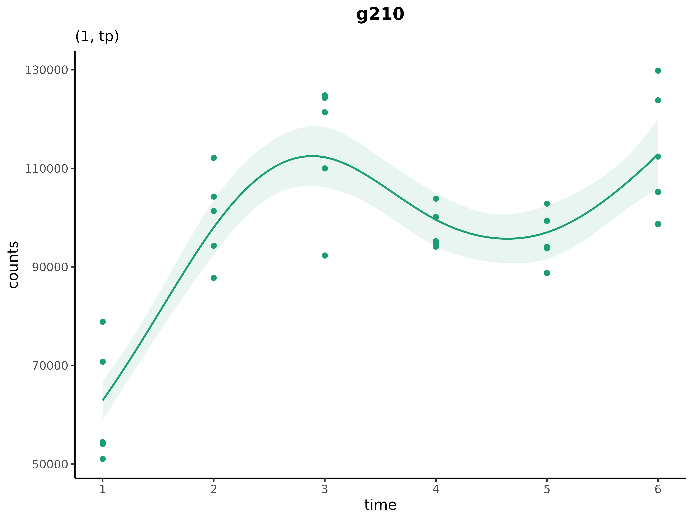
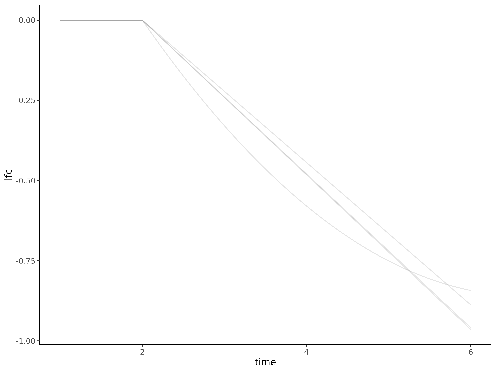

# cpam

### About

This tutorial demonstrates the R package
[`cpam`](https://l-a-yates.github.io/cpam/) for the analysis of time
series omics data. It serves as a basic introduction to the package.
There are also two detailed case studies using real world data:

- [Arabidopsis Case
  Study](https://raw.githack.com/l-a-yates/cpam_manuscript/main/R/torre.html)
- [Human embryo Case
  Study](https://raw.githack.com/l-a-yates/cpam_manuscript/main/R/crisp.html)

These case studies and several simulation studies are presented in the
accompanying [manuscript](https://doi.org/10.1101/2024.12.22.630003) by
Yates et al. (2024). See also, the package
[website](https://l-a-yates.github.io/cpam/).

### Data

The data for the following examples have been simulated based on
empirical RNA-seq data. These data are gene-level counts from a
case-only design with 6 time points and 5 replicates per time point.
Code to reproduce the data is available in this
[repository](https://github.com/l-a-yates/cpam_manuscript).

### Installation

You can install [`cpam`](https://l-a-yates.github.io/cpam/) using:

``` r
install.packages("cpam")
```

## Getting started

### Load packages

``` r
library(cpam)  
library(dplyr)
library(tidyr)
library(stringr)
library(ggplot2)
```

### Experimental design

An example experimental design is included in the `cpam` package. Since
it is case-only design, there are no experimental conditions beyond
time.

``` r

# load example data
load(system.file("extdata", "exp_design_example.rda", package = "cpam"))
exp_design_example
#> # A tibble: 30 × 2
#>    sample  time
#>    <chr>  <int>
#>  1 X1         1
#>  2 X2         1
#>  3 X3         1
#>  4 X4         1
#>  5 X5         1
#>  6 X6         2
#>  7 X7         2
#>  8 X8         2
#>  9 X9         2
#> 10 X10        2
#> # ℹ 20 more rows
```

### Count matrix

The example count data for are provided as a matrix. Let’s take a look
at the first few rows.

``` r
# load example data
load(system.file("extdata", "count_matrix_example.rda", package = "cpam"))
as.data.frame(count_matrix_example) %>% head 
#>          X1     X2     X3     X4     X5     X6     X7     X8     X9    X10    X11    X12    X13    X14    X15    X16
#> g001 100702  93137 100748  90302  95962  79708  89726  85350  94282 121842 102158  90054 103692  78474  80961  81403
#> g002   8654   7926   8930   9196   8882   7993   8479   9865   8015   7060   9523   7124   9004   7840  10012   8161
#> g003   3258   3131   3024   3507   3687   2419   2456   2553   2238   2588   2250   2098   2166   1884   2339   1807
#> g004  24572  18575  28039  27230  25244  24315  26200  24790  26165  22652  24722  20735  27313  30438  26432  25533
#> g005 125565 118382 115517 105728 114457 120633 115978 108458 113169 115742 132714 121729  96647 134781 123007 124228
#> g006   1988   2058   2530   2135   2131   2139   2043   2068   2298   2281   2021   2097   2237   1951   1970   2175
#>         X17    X18   X19    X20    X21    X22    X23    X24    X25    X26    X27    X28    X29   X30
#> g001  76614  87686 81953 106238  87308  83021  81013  95695 109277  97975  79013  88479 119039 80521
#> g002   8789   9250  8816   7514   9565   7690   8946   7980   8919   9059   8227   7858   9253  9145
#> g003   1961   1791  1763   1893   1577   1505   1628   1511   1757   1573   1512   1659   1514  1355
#> g004  23079  27307 24375  26901  27090  28163  26881  26964  23837  24079  21432  23805  21358 29200
#> g005 126771 110148 95926 105201 100622 110298 145240 129146 114071 132796 125034 124525 115182 87204
#> g006   1990   2035  2295   2051   2159   1792   2003   2190   2140   2130   2281   2036   2241  2182
```

### Fitting `cpam`

To fit the models, we first prepare the `cpam` object, then compute
p-values, estimate changepoints, and select the shape for each gene. In
this simple example, simulated data are gene-level, that is we do not
have isoform-level counts. As such, we leave
\`\`\``the transcript-to-gene mapping (`t2g`) and we set`gene_level =
T\`.

``` r
  cpo <- prepare_cpam(exp_design = exp_design_example,
                      count_matrix = count_matrix_example,
                      model_type = "case-only",
                      t2g = NULL,
                      gene_level = T,
                      num_cores = 1) # just for the example
  cpo <- compute_p_values(cpo) # 6 seconds
  cpo <- estimate_changepoint(cpo) # 4 seconds
  cpo <- select_shape(cpo) # 5 seconds
```

We can look at a summary of the fitted cpam object

``` r
cpo
```

If you run the code on your own computer, you can launch the Shiny app
to visualise the results interactively using `visualise(cpo)`.

### Result tables

The results of the analysis are summarised using the `results` function.

``` r
results(cpo)
#> # A tibble: 104 × 16
#>    target_id         p    cp shape lfc.1  lfc.2  lfc.3  lfc.4  lfc.5  lfc.6 counts.1 counts.2 counts.3 counts.4 counts.5
#>    <chr>         <dbl> <dbl> <chr> <dbl>  <dbl>  <dbl>  <dbl>  <dbl>  <dbl>    <dbl>    <dbl>    <dbl>    <dbl>    <dbl>
#>  1 g003      9.26e-319     1 mdcx      0 -0.349 -0.634 -0.856 -1.02  -1.11    3267.    2566.    2105.    1805.    1617. 
#>  2 g013      9.26e-319     3 ilin      0  0      0      0.327  0.655  0.982  18662.   18662.   18662.   23416.   29382. 
#>  3 g055      9.26e-319     1 ilin      0  0.195  0.389  0.584  0.778  0.973    608.     696.     796.     911.    1043. 
#>  4 g063      9.26e-319     1 cv        0  0.595  0.937  1.03   0.861  0.443   6172.    9322.   11814.   12563.   11210. 
#>  5 g069      9.26e-319     2 ilin      0  0      0.225  0.451  0.676  0.902  67904.   67904.   79391.   92821.  108524. 
#>  6 g090      9.26e-319     2 ilin      0  0      0.238  0.476  0.715  0.953     32.9     32.9     38.7     45.7     53.9
#>  7 g106      9.26e-319     1 mdcx      0 -0.470 -0.778 -0.892 -0.902 -0.902  30076.   21709.   17542.   16202.   16090. 
#>  8 g126      9.26e-319     1 ilin      0  0.225  0.450  0.675  0.900  1.12    4017.    4695.    5487.    6412.    7494. 
#>  9 g128      9.26e-319     1 ilin      0  0.209  0.418  0.628  0.837  1.05   38099.   44043.   50915.   58859.   68043. 
#> 10 g129      9.26e-319     1 cv        0  0.626  0.978  1.11   1.08   0.888    259.     399.     510.     560.     545. 
#> # ℹ 94 more rows
#> # ℹ 1 more variable: counts.6 <dbl>
```

The generated results can be filtered by specifying minimum counts,
minimum log-fold changes, and maximum $p$-values. For example, to return
only the transcripts with a log-fold change greater than 1, at least 10
counts, and a $p$-value less than 0.01, we can run

``` r
results(cpo, min_count = 10, min_lfc = 1, p_threshold = 0.01)
#> # A tibble: 22 × 16
#>    target_id         p    cp shape lfc.1  lfc.2  lfc.3  lfc.4 lfc.5 lfc.6 counts.1 counts.2 counts.3 counts.4 counts.5
#>    <chr>         <dbl> <dbl> <chr> <dbl>  <dbl>  <dbl>  <dbl> <dbl> <dbl>    <dbl>    <dbl>    <dbl>    <dbl>    <dbl>
#>  1 g063      9.26e-319     1 cv        0  0.595  0.937  1.03  0.861 0.443   6172.    9322.   11814.   12563.   11210. 
#>  2 g126      9.26e-319     1 ilin      0  0.225  0.450  0.675 0.900 1.12    4017.    4695.    5487.    6412.    7494. 
#>  3 g128      9.26e-319     1 ilin      0  0.209  0.418  0.628 0.837 1.05   38099.   44043.   50915.   58859.   68043. 
#>  4 g129      9.26e-319     1 cv        0  0.626  0.978  1.11  1.08  0.888    259.     399.     510.     560.     545. 
#>  5 g171      9.26e-319     1 cv        0  0.593  0.922  1.01  0.901 0.616   4950.    7468.    9382.    9989.    9241. 
#>  6 g186      9.26e-319     1 cx        0 -0.233 -0.324 -0.209 0.219 1.05   19740.   16792.   15774.   17077.   22974. 
#>  7 g331      9.26e-319     3 ilin      0  0      0      0.339 0.678 1.02      37.0     37.0     37.0     46.8     59.1
#>  8 g334      9.26e-319     1 micv      0  0.402  0.692  0.886 1.00  1.06    2798.    3696.    4519.    5171.    5614. 
#>  9 g341      9.26e-319     1 cx        0 -0.465 -0.593 -0.383 0.164 1.05   23681.   17157.   15704.   18161.   26532. 
#> 10 g393      9.26e-319     1 cv        0  0.432  0.747  0.945 1.02  0.987    932.    1257.    1564.    1793.    1896. 
#> # ℹ 12 more rows
#> # ℹ 1 more variable: counts.6 <dbl>
```

### Plotting genes and transcripts

A single gene can be plotted using the `plot_cpam` function. Here we
plot the gene g063

``` r
plot_cpam(cpo, gene_id = "g063")
```

 The subtitle shows `(1,cv)`
indicating a changepoint at first time point (i.e., the gene responds
immediately) and a convex (`'cv'`) shaped trend.

Let’s look for a gene that has a more complex trend. Unconstrained
shapes in `cpam` are denoted by `'tp'`.^([1](#fn1)) We can filter the
results for genes with unconstrained shapes and plot one of them.

``` r
results(cpo) %>% 
  filter(shape == "tp")
#> # A tibble: 14 × 16
#>    target_id         p    cp shape lfc.1  lfc.2  lfc.3   lfc.4  lfc.5   lfc.6 counts.1 counts.2 counts.3 counts.4
#>    <chr>         <dbl> <dbl> <chr> <dbl>  <dbl>  <dbl>   <dbl>  <dbl>   <dbl>    <dbl>    <dbl>    <dbl>    <dbl>
#>  1 g210      9.26e-319     1 tp        0  0.640  0.835  0.662   0.624  0.842    62930.   98034.  112257.   99573.
#>  2 g325      9.26e-319     1 tp        0 -0.896 -0.881 -0.157   0.209 -0.0882   68067.   36583.   36956.   61053.
#>  3 g335      9.26e-319     1 tp        0  0.251  0.310  0.240   0.455  0.979     1155.    1374.    1432.    1364.
#>  4 g339      9.26e-319     1 tp        0 -0.754 -0.775 -0.307  -0.367 -0.913     4361.    2586.    2548.    3526.
#>  5 g399      9.26e-319     1 tp        0  0.248  0.486  0.704   0.874  1.01      3917.    4652.    5487.    6382.
#>  6 g400      9.26e-319     1 tp        0 -0.915 -0.672  0.558   0.706 -0.268     9725.    5159.    6105.   14312.
#>  7 g417      9.26e-319     1 tp        0 -0.424 -0.573 -0.532  -0.710 -0.982     7232.    5390.    4861.    5003.
#>  8 g424      9.26e-319     1 tp        0 -0.324 -0.226  0.0439 -0.204 -0.905     9557.    7636.    8173.    9852.
#>  9 g640      9.26e-319     1 tp        0  0.574  0.765  0.396   0.497  0.920     1044.    1554.    1773.    1373.
#> 10 g715      9.26e-319     1 tp        0  0.835  0.808 -0.238  -0.680 -0.333   157157.  280360.  275216.  133216.
#> # ℹ 4 more rows
#> # ℹ 2 more variables: counts.5 <dbl>, counts.6 <dbl>
```

We plot the first gene in the list.

``` r
plot_cpam(cpo, gene_id = "g210")
```

 This selection of `'tp'`
suggests that the trend for this gene does not conform to one of the
simpler shape types that `cpam` uses. We can exclude `'tp'` as an option
and force `cpam` to choose among the simpler forms by setting
`shape_type = "shape2"` in the `plot_cpam` function (`"shape1"`, the
default, allows the `'tp'`). This choice can be useful for analysis such
as clustering. For example:

``` r
plot_cpam(cpo, gene_id = "g210",shape_type = "shape2")
```

 Here a monotonic
increasing concave shape (‘micv’) is chosen, and we can see this trend
deviates from the data substantially more that the unconstrained shape.
See the [manuscript](https://doi.org/10.1101/2024.12.22.630003) for more
details on the shape types available in `cpam`.

Next we look for a gene with a changepoint by filtering for genes with
changepoints at the third time point.

``` r
results(cpo) %>% 
  filter(cp == 3)
#> # A tibble: 13 × 16
#>    target_id         p    cp shape lfc.1 lfc.2 lfc.3  lfc.4  lfc.5  lfc.6 counts.1 counts.2 counts.3 counts.4 counts.5
#>    <chr>         <dbl> <dbl> <chr> <dbl> <dbl> <dbl>  <dbl>  <dbl>  <dbl>    <dbl>    <dbl>    <dbl>    <dbl>    <dbl>
#>  1 g013      9.26e-319     3 ilin      0     0     0  0.327  0.655  0.982  18662.   18662.   18662.   23416.   29382. 
#>  2 g146      9.26e-319     3 dlin      0     0     0 -0.329 -0.659 -0.988    168.     168.     168.     134.     106. 
#>  3 g187      9.26e-319     3 dlin      0     0     0 -0.419 -0.839 -1.26   18216.   18216.   18216.   13622.   10186. 
#>  4 g297      9.26e-319     3 ilin      0     0     0  0.308  0.616  0.924   9799.    9799.    9799.   12133.   15021. 
#>  5 g304      9.26e-319     3 cx        0     0     0 -1.04  -0.652  0.883   3130.    3130.    3130.    1520.    1993. 
#>  6 g331      9.26e-319     3 ilin      0     0     0  0.339  0.678  1.02      37.0     37.0     37.0     46.8     59.1
#>  7 g559      9.26e-319     3 ilin      0     0     0  0.292  0.584  0.877    444.     444.     444.     543.     665. 
#>  8 g623      9.26e-319     3 micv      0     0     0  0.317  0.634  0.951    329.     329.     329.     409.     510. 
#>  9 g634      9.26e-319     3 cx        0     0     0 -0.880 -1.13  -0.759  12547.   12547.   12547.    6818.    5721. 
#> 10 g652      9.26e-319     3 ilin      0     0     0  0.363  0.726  1.09   13016.   13016.   13016.   16739.   21528. 
#> # ℹ 3 more rows
#> # ℹ 1 more variable: counts.6 <dbl>
```

Again, we plot the first gene in the list.

``` r
plot_cpam(cpo, gene_id = "g013")
```


### Clusters

The results function can be used to generate clusters according to
selected filters. The `plot_cluster` function can then be used to
visualise the clusters. With such a small simulated data set, we don’t
have many genes in each cluster, but we can try a few different
clustering options to get an idea of how the function works.

``` r
res <- results(cpo)
plot_cluster(cpo, res, changepoints = 1, shapes = c("cv"))
```

 There are 19 genes with a
concave shape and a changepoint at the first time point.

More than one shape or changepoint can be provided. For example:

``` r
plot_cluster(cpo, res, changepoints = 2, shapes = c("dlin","mdcx"))
```

 There are just four genes
with decreasing linear or monotonic decreasing convex shapes which have
a changepoint at the second time point.

Clustering can be further refined based on, for example, the rate at
which the above transcripts attain their maximum values. We illustrate
advanced refinements such as this [case
study](https://raw.githack.com/l-a-yates/cpam_manuscript/main/R/torre.html).

### Many more options

This is just a simple example to get you started. The package has many
more features and options. Check out the two case studies to see how
`cpam` can be used to analyse real-world data:

- [Arabidopsis Case
  Study](https://raw.githack.com/l-a-yates/cpam_manuscript/main/R/torre.html)
- [Human Embryo Case
  Study](https://raw.githack.com/l-a-yates/cpam_manuscript/main/R/crisp.html)

## Session Info

Click to expand

``` r
sessionInfo()
#> R version 4.5.2 (2025-10-31)
#> Platform: x86_64-pc-linux-gnu
#> Running under: Ubuntu 24.04.3 LTS
#> 
#> Matrix products: default
#> BLAS:   /usr/lib/x86_64-linux-gnu/openblas-pthread/libblas.so.3 
#> LAPACK: /usr/lib/x86_64-linux-gnu/openblas-pthread/libopenblasp-r0.3.26.so;  LAPACK version 3.12.0
#> 
#> locale:
#>  [1] LC_CTYPE=C.UTF-8       LC_NUMERIC=C           LC_TIME=C.UTF-8        LC_COLLATE=C.UTF-8     LC_MONETARY=C.UTF-8   
#>  [6] LC_MESSAGES=C.UTF-8    LC_PAPER=C.UTF-8       LC_NAME=C              LC_ADDRESS=C           LC_TELEPHONE=C        
#> [11] LC_MEASUREMENT=C.UTF-8 LC_IDENTIFICATION=C   
#> 
#> time zone: UTC
#> tzcode source: system (glibc)
#> 
#> attached base packages:
#> [1] stats     graphics  grDevices utils     datasets  methods   base     
#> 
#> other attached packages:
#> [1] ggplot2_4.0.1   stringr_1.6.0   tidyr_1.3.1     dplyr_1.1.4     cpam_0.1.3.9000
#> 
#> loaded via a namespace (and not attached):
#>  [1] sass_0.4.10        utf8_1.2.6         generics_0.1.4     stringi_1.8.7      lattice_0.22-7     digest_0.6.39     
#>  [7] magrittr_2.0.4     evaluate_1.0.5     grid_4.5.2         RColorBrewer_1.1-3 fastmap_1.2.0      Matrix_1.7-4      
#> [13] jsonlite_2.0.0     limma_3.66.0       mgcv_1.9-3         purrr_1.2.0        scales_1.4.0       codetools_0.2-20  
#> [19] textshaping_1.0.4  jquerylib_0.1.4    cli_3.6.5          rlang_1.1.6        pbmcapply_1.5.1    splines_4.5.2     
#> [25] scam_1.2-20        withr_3.0.2        cachem_1.1.0       yaml_2.3.11        tools_4.5.2        parallel_4.5.2    
#> [31] locfit_1.5-9.12    vctrs_0.6.5        R6_2.6.1           matrixStats_1.5.0  lifecycle_1.0.4    edgeR_4.8.0       
#> [37] fs_1.6.6           ragg_1.5.0         pkgconfig_2.0.3    desc_1.4.3         pkgdown_2.2.0      pillar_1.11.1     
#> [43] bslib_0.9.0        gtable_0.3.6       Rcpp_1.1.0         glue_1.8.0         statmod_1.5.1      systemfonts_1.3.1 
#> [49] xfun_0.54          tibble_3.3.0       tidyselect_1.2.1   knitr_1.50         farver_2.1.2       nlme_3.1-168      
#> [55] htmltools_0.5.8.1  labeling_0.4.3     rmarkdown_2.30     compiler_4.5.2     S7_0.2.1           mvnfast_0.2.8
```

  

¹`tp` stands for *thinplate* which is the type of spline used for the
‘unconstrained’ curves as defined in the `mgcv` package. The curves are
still penalised to be smooth, but the shape type is not fixed.

## References

Yates, Luke A., Jazmine L. Humphreys, Michael A. Charleston, and Steven
M. Smith. 2024. “Shape-Constrained, Changepoint Additive Models for Time
Series Omics Data with *Cpam*.” *BioRxiv*, December.
<https://doi.org/10.1101/2024.12.22.630003>.
